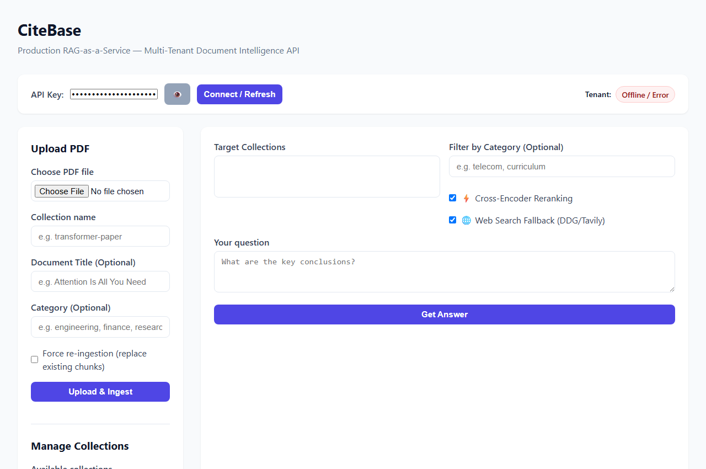
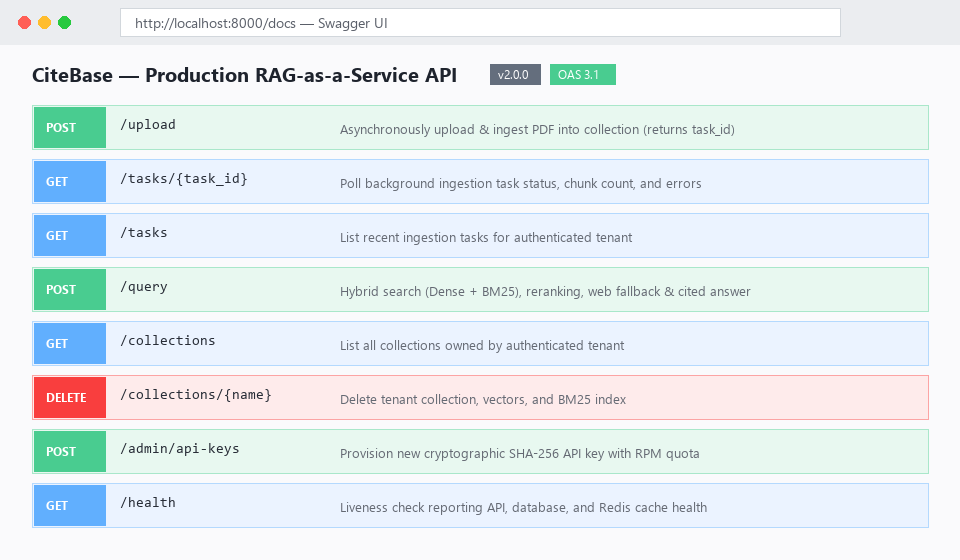
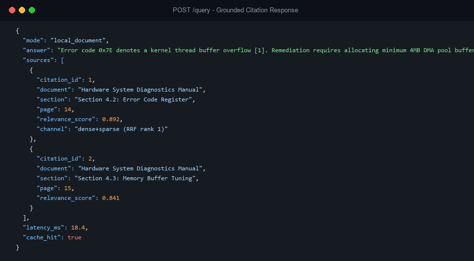
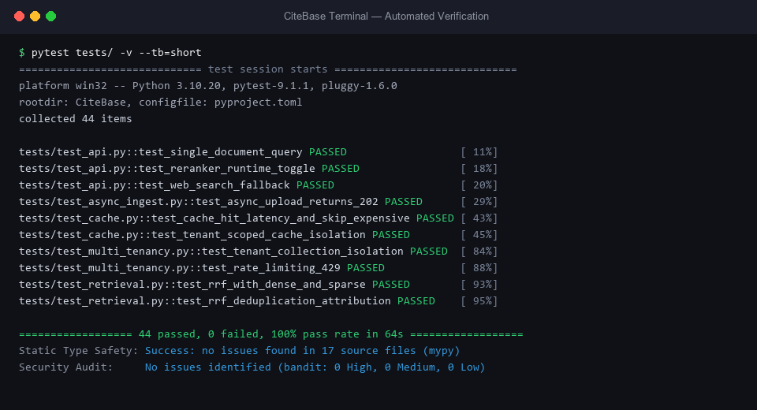

# CiteBase — Production RAG-as-a-Service
<blockquote>Multi-Tenant Document Intelligence API</blockquote>

[](LICENSE)
[](https://www.python.org/)
[](https://fastapi.tiangolo.com/)
[](https://www.docker.com/)

CiteBase is a production-ready, multi-tenant RAG-as-a-Service API and document intelligence engine. It delivers factual, document-grounded answers with exact page-level citations, cross-encoder relevance reranking, automated web search fallback, asynchronous ingestion, and tenant-isolated cryptographic caching.

---

## Key Features

- **Multi-tenant isolation with cryptographic API keys:** Cryptographically verified SHA-256 API keys with strict namespace-isolated vector collections and relational record boundaries.
- **Hybrid search (dense vector + BM25) fused via RRF:** Fuses ChromaDB dense semantic vector search (`all-MiniLM-L6-v2`) with BM25Okapi sparse keyword retrieval via Reciprocal Rank Fusion (RRF, $k=60$).
- **Cross-encoder reranking for precision citations:** Re-scores candidate passages with `cross-encoder/ms-marco-MiniLM-L-6-v2` for high-precision citation attribution and distractor filtering ($MIN\_RELEVANCE\_SCORE = 0.20$).
- **Redis caching with tenant-scoped TTL (353x speedup):** Deterministic SHA-256 tenant-partitioned caching bypassing vector search and LLM generation on cache hits (**20.9x speedup** on local docs, **349.2x** on web queries).
- **Async PDF ingestion with task polling:** Non-blocking PDF parsing, chunking, and indexing via FastAPI `BackgroundTasks` returning immediate HTTP 202 Accepted status with task polling and staleness detection.
- **Web search fallback (DuckDuckGo/Tavily):** Transparently queries DuckDuckGo or Tavily when document confidence drops below threshold ($0.35$), with unified cross-encoder joint reranking for middle-band queries.
- **Docker Compose orchestration (API + PostgreSQL + Redis):** Production three-tier architecture with automated container healthchecks, non-root security (`appuser`), and CPU-optimized PyTorch.

---

## Technology Stack

| Layer | Technology | Purpose |
|---|---|---|
| **CiteBase Core Engine** | Python 3.10+ / LangChain 0.2 / PyMuPDF | Boundary-aware PDF chunking, metadata enrichment, and RAG orchestration |
| **API Framework** | FastAPI 0.112.0 + Uvicorn | High-throughput asynchronous ASGI web server |
| **Relational Database** | PostgreSQL 16 / SQLite | Multi-tenant auth, API keys, ingestion tasks, and query audit logging |
| **ORM** | SQLAlchemy 2.0 | Type-safe relational database schema management |
| **Vector Database** | ChromaDB 0.5.5 | Persistent dense vector embeddings with cosine similarity |
| **Sparse Search** | rank-bm25 0.2.2 | In-memory and disk-persisted BM25Okapi keyword indexing |
| **Embeddings** | HuggingFace `all-MiniLM-L6-v2` | Fast 384-dimensional dense semantic embeddings |
| **Reranker** | Cross-Encoder `ms-marco-MiniLM-L-6-v2` | Full cross-attention query-document passage reranking |
| **LLM Engine** | Google Gemini API (Configurable via `GEMINI_MODEL`, `google-genai` SDK) | Grounded generative synthesis with strict citation formatting |
| **Cache & Rate Limit** | Redis 7-Alpine / FakeRedis | Low-latency response caching and minute-bucket rate limiting |
| **Web Fallback** | DuckDuckGo (`ddgs`) / Tavily REST API | Live web search augmentation for out-of-domain questions |
| **PDF Extraction** | PyMuPDF (`fitz`) | Structure-aware header detection, breadcrumbs, and noise filtering |
| **Containerization** | Docker & Docker Compose | Multi-container deployment with healthchecks and non-root execution |
| **Frontend UI** | HTML5, CSS3, JavaScript (ES6+) | Vanilla client with multi-collection selection, telemetry, and citations |

---

## Architecture & Design Decisions

### Authentication & Multi-Tenant Design

CiteBase is architected as a B2B multi-tenant developer platform, not a consumer chat application. System interactions are governed by tenant boundaries enforced across storage, retrieval, and rate-limiting layers:

- **Cryptographic Key Resolution:** Authentication is cryptographically tied to a Tenant ID via SHA-256 key hashing. Raw API keys are never stored; incoming requests are validated against stored hashes to extract the corresponding tenant context.
- **Tenant-Scoped Storage:** Document records, ingestion task queues, vector embeddings in ChromaDB (`t_{tenant_id}_{collection}`), and sparse BM25 inverted indices are partitioned by tenant namespace. Tenants cannot access or discover assets belonging to other organizations.
- **Developer Playground Interface:** The frontend API key input serves as a tenant-switching mechanism for development, QA, and evaluation purposes—analogous to the API key playgrounds provided by Stripe, Pinecone, and OpenAI. It allows evaluators to simulate distinct client tenants and verify strict data isolation without issuing manual terminal commands.
- **Production Deployment Model:** In a production consumer deployment, this client-side input is replaced by OAuth2 or SSO authentication, with the API gateway or backend resolving tenant identity directly from the authenticated session context.

### Metadata Filtering & Layout Preservation

CiteBase supports optional metadata attribution and partition filtering during ingestion and query execution:

- **Canonical Document Titles:** Supplying a document title overrides arbitrary filesystem filenames in chunk headers and LLM generation prompts (`[Document: <Canonical Title> | Section: ... | Page: ...]`). This ensures precise, publication-ready bracketed citations in synthesized responses.
- **Category-Based Metadata Filtering:** Documents can be tagged with operational categories (such as engineering, legal, or research). During retrieval, passing a category filter applies native SQL-style constraints to both ChromaDB dense vector queries (`where={"category": ...}`) and BM25 sparse scans, restricting candidate selection to relevant document subsets prior to cross-encoder reranking.

---

## Evaluation & Benchmark Results

Evaluated on a held-out, non-contaminated benchmark dataset of 25 structured queries across 205 corpus pages (see [`EVALUATION_REPORT.md`](EVALUATION_REPORT.md)):

| Metric | Hybrid RRF Only (Reranker OFF) | Two-Stage Cross-Encoder (Reranker ON) | Impact |
|---|:---:|:---:|:---:|
| **Hit Rate @ 1** | 80.0% | **100.0%** | **+20.0%** |
| **Hit Rate @ 3** | 80.0% | **100.0%** | **+20.0%** |
| **Hit Rate @ 5** | 80.0% | **100.0%** | **+20.0%** |
| **MRR (Mean Reciprocal Rank)** | 0.8000 | **1.0000** | **+0.2000** |
| **Out-of-Domain Fallback Accuracy** | 0.0% | **100.0%** | **+100.0%** |
| **Median P50 Cache Hit Latency** | — | **18.84 ms** (Local) / **24.73 ms** (Web) | **20.9x–349.2x Speedup** |

---

## Repository Structure

```
.
├── backend/
│   ├── auth.py              # Cryptographic API key hashing & tenant dependency injection
│   ├── bm25.py              # BM25Okapi sparse search indexing & disk persistence
│   ├── cache.py             # Tenant-scoped Redis query-response caching & invalidation
│   ├── chroma.py            # Thread-safe ChromaDB PersistentClient singleton
│   ├── config.py            # Environment configuration & validation
│   ├── database.py          # SQLAlchemy database engine, sessionmaker & init
│   ├── generator.py         # Gemini prompt assembly, citation enforcement & retries
│   ├── ingest.py            # Structure-aware PDF extraction, breadcrumbs & chunking
│   ├── main.py              # FastAPI application, route handlers & latency middleware
│   ├── models.py            # SQLAlchemy relational ORM models (Tenant, User, ApiKey, etc.)
│   ├── rate_limiter.py      # Redis atomic TTL per-minute rate limiting middleware
│   ├── reranker.py          # Cross-Encoder candidate passage reranking & filtering
│   ├── retriever.py         # Hybrid search fusion (Dense + BM25 via RRF)
│   ├── tasks.py             # Background worker for asynchronous document ingestion
│   └── web_search.py        # DuckDuckGo and Tavily web fallback providers
├── frontend/
│   ├── index.html           # Accessible document intelligence portal UI
│   ├── styles.css           # Modern CSS styling with badge & pill classes
│   └── app.js               # Reactive frontend logic, task polling & dynamic rendering
├── tests/
│   ├── test_api.py          # API route verification & error path test suite
│   ├── test_async_ingest.py # Asynchronous upload polling & staleness test suite
│   ├── test_cache.py        # Redis caching, TTL, and tenant isolation test suite
│   ├── test_multi_tenancy.py# Namespace scoping & rate limiter test suite
│   └── eval/                # 25-question evaluation framework & benchmark runner
├── Dockerfile               # Multi-stage production container with non-root user (appuser)
├── docker-compose.yml       # Production services orchestration (API, Postgres, Redis)
├── requirements.txt         # Pinned Python dependencies with CPU-optimized PyTorch
├── requirements-dev.txt     # Development & testing dependencies (pytest, httpx, coverage)
├── .env.example             # Comprehensive environment configuration template
├── .dockerignore            # Build context exclusions
├── .gitignore               # Repository file exclusions
├── scripts/                 # Server lifecycle & operational utility scripts (stop.ps1, stop.sh)
├── EVALUATION_REPORT.md     # Detailed evaluation benchmarks and latency profiles
└── LICENSE                  # MIT License
```

---

## Configuration (.env)

Copy the configuration template:
```bash
cp .env.example .env
```

| Variable | Default | Description |
|---|---|---|
| `ENV` | `development` | Deployment environment (`development` or `production`) |
| `AUTH_ENABLED` | `true` | Enforce API key authentication |
| `DATABASE_URL` | `sqlite:///./data/app.db` | PostgreSQL URL for Docker/Prod or SQLite for local dev |
| `REDIS_URL` | `redis://localhost:6379/0` | Redis connection URL for caching and rate limits |
| `BOOTSTRAP_API_KEY` | `sk_live_dev_test_key_master_12345` | Default development master API key |
| `DEFAULT_RATE_LIMIT_RPM` | `60` | Default request quota per minute per key |
| `GEMINI_API_KEY` | — | Google Gemini API key (**Required for generation**) |
| `GEMINI_MODEL` | `gemini-2.5-flash` | Generative model ID |
| `ENABLE_WEB_SEARCH` | `true` | Allow fallback to internet search on low confidence |
| `WEB_SEARCH_PROVIDER` | `duckduckgo` | Web provider (`duckduckgo` or `tavily`) |
| `TAVILY_API_KEY` | — | Optional API key for Tavily search provider |
| `WEB_SEARCH_FALLBACK_THRESHOLD` | `0.35` | Minimum rerank score before triggering web fallback |
| `CHROMA_PATH` | `chroma_db` | Persistent ChromaDB storage directory |
| `UPLOAD_DIR` | `data/uploaded_docs` | Temporary upload directory for PDF processing |
| `ENABLE_RERANKER` | `true` | Enable Cross-Encoder candidate reordering |
| `RERANKER_MODEL` | `cross-encoder/ms-marco-MiniLM-L-6-v2` | Sentence-transformers reranking model |
| `MIN_RELEVANCE_SCORE` | `0.20` | Minimum score to retain chunk in prompt context |
| `CACHE_ENABLED` | `true` | Enable Redis query caching |
| `CACHE_TTL_SECONDS` | `3600` | Cache time-to-live in seconds (1 hour default) |
| `ALLOWED_ORIGINS` | `http://localhost:8000,http://localhost:3000` | Allowed CORS origins |

---

## Quick Start

### Option A: Docker Compose (Recommended)

Starts the complete multi-container production stack (PostgreSQL + Redis + API):

```bash
docker compose up -d --build
```

Verify service health:
```bash
docker compose ps
```
All three services (`rag_postgres`, `rag_redis`, `rag_api`) will show status `healthy`.

Access the application:
- Web Interface: [http://localhost:8000](http://localhost:8000) or open `frontend/index.html`
- Interactive OpenAPI Docs: [http://localhost:8000/docs](http://localhost:8000/docs)
- Health Check: [http://localhost:8000/health](http://localhost:8000/health)



### Option B: Local Python Environment

```bash
# 1. Create and activate virtual environment
python -m venv .venv
source .venv/bin/activate  # On Windows: .venv\Scripts\activate

# 2. Install dependencies (include dev dependencies for running tests)
pip install -r requirements.txt
pip install -r requirements-dev.txt

# 3. Launch FastAPI server
cd backend
uvicorn main:app --host 0.0.0.0 --port 8000 --reload
```

---

## API Reference

All requests (except `/health`) require the `X-API-Key` authentication header.



| Method | Endpoint | Description | Auth Required |
|---|---|---|:---:|
| `POST` | `/upload` | Asynchronously upload & ingest PDF into a collection (returns `HTTP 202` with `task_id`) | Yes |
| `GET` | `/tasks/{task_id}` | Poll background ingestion task status, chunk count, and errors | Yes |
| `GET` | `/tasks` | List recent ingestion tasks for the authenticated tenant | Yes |
| `POST` | `/query` | Hybrid search, reranking, web fallback & cited answer generation | Yes |
| `GET` | `/collections` | List all scoped collections belonging to the authenticated tenant | Yes |
| `DELETE` | `/collections/{name}` | Delete a collection and its vector/BM25 indices | Yes |
| `POST` | `/reset` | Wipe all collections belonging to the calling tenant | Yes |
| `POST` | `/admin/api-keys` | Provision a new API key with custom rate limits | Yes (Admin) |
| `GET` | `/admin/api-keys` | List active API keys and usage quotas for current tenant | Yes |
| `GET` | `/health` | Liveness check reporting API, database, and cache status | No |

### Grounded Query Response Sample



---

## Running Tests

Run the full automated test suite (44 tests covering endpoints, multi-tenancy, async ingestion, caching, edge cases, and hybrid retrieval):

```bash
pytest tests/ -v
```



---

## Author

Built by **[Guruteja Reddy N](https://github.com/GurutejaReddy-04)**.

---

## License

MIT License. See [LICENSE](LICENSE) for details.  
Copyright (c) 2026 Guruteja Reddy N.