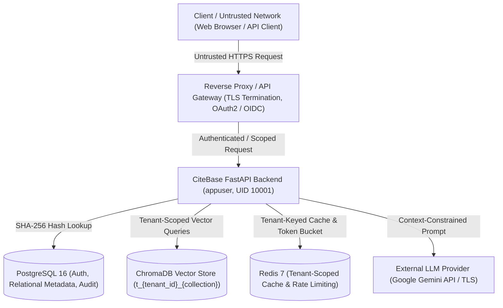
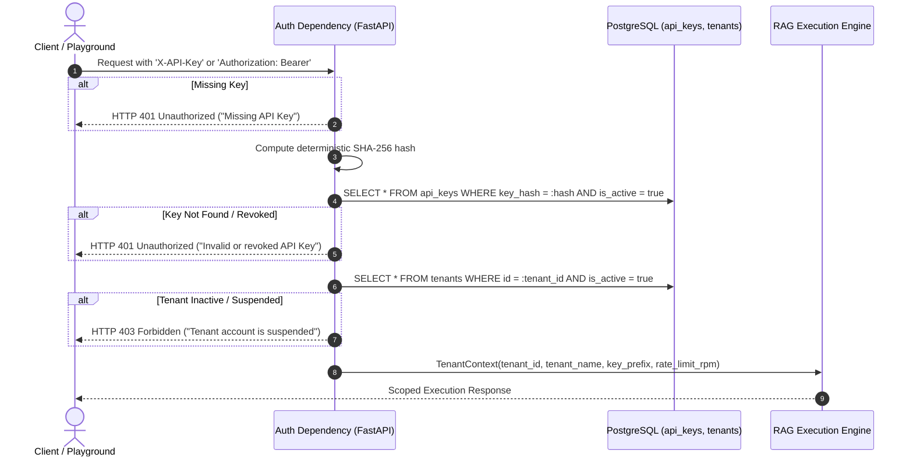

# CiteBase Security Specification & Architecture Model

## 1. Executive Summary & Objective

CiteBase is architected as an enterprise-grade, multi-tenant RAG-as-a-Service (Retrieval-Augmented Generation) document intelligence platform. Because the system manages proprietary tenant documents, performs dense/sparse vector index lookups, and synthesizes answers via large language models, security is a first-class architectural concern.

This document outlines the threat model, authentication lifecycle, multi-tenant partition boundaries, credential storage specifications, and production deployment hardening guidelines.

---

## 2. Threat Model & Trust Boundaries



### Assets Protected
1. **Tenant Documents & Ingested Content:** Raw PDFs and extracted textual chunks.
2. **Dense & Sparse Vector Indices:** 384-dimensional semantic embeddings in ChromaDB and BM25 inverted indices.
3. **Cached Query Responses:** LLM answers and citation metadata cached in Redis.
4. **Relational Records & Audit Trails:** Tenant metadata, API key hashes, ingestion tasks, and query execution logs in PostgreSQL.
5. **System Credentials:** Master bootstrap keys, database credentials, and external LLM provider API tokens.

### Threat Vectors & Mitigations
| Threat Vector | Potential Impact | CiteBase Architectural Mitigation |
|:---|:---|:---|
| **Cross-Tenant Data Leakage** | Tenant B discovers or queries Tenant A documents. | Cryptographic tenant resolution from SHA-256 key hash; strict runtime namespacing of vector collections (`t_{tenant_id[:12]}_{coll}`), BM25 indices, and Redis cache keys. |
| **API Key Brute-Force / Enumeration** | Attacker guesses high-entropy API keys. | Keys generated with 256 bits of entropy (`secrets.token_urlsafe(32)`); constant-time SHA-256 lookup; Redis sliding-window rate limiting per key. |
| **Plaintext Credential Compromise** | Database backup leak exposes raw API keys. | Plaintext keys are **never stored**. Only irreversible SHA-256 hashes are persisted in PostgreSQL. |
| **Application-Level XSS Exposure** | Injected JavaScript reads long-lived browser credentials. | Frontend playground migrates away from persistent `localStorage` to ephemeral `sessionStorage` scoped strictly to the active tab. |
| **Denial of Service via Heavy Ingestion / Queries** | Resource exhaustion crashing server. | Asynchronous background processing (HTTP 202); file size limits (`MAX_UPLOAD_BYTES = 50MB`); query text length limits (`max_length = 2000`); per-tenant sliding-window rate limiting. |
| **Prompt Injection / Grounding Bypass** | Malicious document content overrides generation prompt. | Context passages strictly wrapped in structured fences (`--- CONTEXT START ---`); system prompt instructs model to answer exclusively from numbered citations or return explicit refusal. |

---

## 3. Authentication & Tenant Resolution Flow



1. **Header Extraction:** Fast extraction from either `X-API-Key` or `Authorization: Bearer <key>`.
2. **SHA-256 Hash Matching:** Deterministic SHA-256 hash compared against database records.
3. **Dual Status Verification:** Requests fail closed unless both the API key and its owning Tenant record are explicitly active (`is_active = True`).
4. **TenantContext Propagation:** Downstream controllers receive a read-only, strongly typed `TenantContext` containing the tenant ID, name, rate limit, and key prefix.

---

## 4. Multi-Tenant Isolation Architecture

### 4.1 Relational Database Partitioning
Every entity in PostgreSQL (`DocumentRecord`, `IngestionTask`, `QueryLog`, `ApiKey`) enforces foreign-key linkage to a specific `tenant_id`. Application queries strictly enforce tenant scoping:
```sql
SELECT * FROM document_records WHERE tenant_id = :tenant_id AND collection_name = :coll;
```

### 4.2 Vector Database Namespacing (ChromaDB)
To prevent cross-tenant vector contamination in ChromaDB, collections are dynamically prefixed using the tenant's identifier:
```python
def get_scoped_collection_name(tenant_id: str, raw_name: str) -> str:
    clean_name = raw_name.strip().lower()
    tenant_prefix = tenant_id[:12]
    # Guarantees total length <= 63 characters for ChromaDB compliance
    return f"t_{tenant_prefix}_{clean_name[:45]}"
```
Even if Tenant B submits an API request targeting a collection named `financial_audit`, the backend maps it to `t_{tenant_b_id[:12]}_financial_audit`, ensuring complete partition isolation from Tenant A's `t_{tenant_a_id[:12]}_financial_audit`.

### 4.3 Sparse Keyword Index Isolation (BM25)
BM25 sparse indices are saved atomically on disk using paths scoped strictly by the internal collection identifier:
`data/bm25_indices/{scoped_collection_name}.json`
Tenant collections cannot access, read, or overwrite index files belonging to other organizations.

### 4.4 Cache Partitioning (Redis)
All Redis response cache keys are strictly namespaced by tenant ID:
`rag:cache:{tenant_id}:{query_sha256}`
Even if Tenant A and Tenant B ask the exact same question against their own collections, Tenant B will **never** receive Tenant A's cached response.

---

## 5. API Key Lifecycle & Storage

### 5.1 High-Entropy Generation
Keys are generated using Python's cryptographically secure pseudo-random number generator (`secrets.token_urlsafe(32)`), producing 256 bits of entropy. Keys are formatted with standard prefixes:
`sk_live_{token}`

### 5.2 Irreversible Storage
Plaintext API keys are **never stored** in persistent storage.
- At generation time, the plaintext token is displayed to the administrator exactly once.
- The database stores only `key_hash = hashlib.sha256(raw_key.encode('utf-8')).hexdigest()`.
- For operational logging and operator identification, an abbreviated 12-character prefix is recorded (`key_prefix = raw_key[:12]`, e.g. `sk_live_a1b2...`).

### 5.3 Zero-Downtime Rotation Protocol
To rotate credentials without downtime:
1. Issue an API call or administrative migration creating a new active `ApiKey` for the tenant.
2. Update client configuration / API consumer systems with the new key.
3. Validate that requests succeed under the new key prefix in audit logs.
4. Revoke the old key by setting `is_active = False`. The change takes effect immediately across all instances.

---

## 6. Rate Limiting & Abuse Prevention

CiteBase utilizes Redis sliding-window token counters to enforce tenant quotas (`rate_limit_rpm`):
- **Per-Key Scoping:** Rate limits are tracked per active API key ID: `rate_limit:{api_key_id}:{current_minute}`.
- **HTTP 429 Response:** Exceeded quotas return HTTP 429 with informative response headers:
  ```http
  HTTP/1.1 429 Too Many Requests
  Retry-After: 60
  X-RateLimit-Limit: 60
  X-RateLimit-Remaining: 0
  ```
- **Fail-Open In-Memory Fallback:** If Redis is temporarily unreachable, the rate limiter falls back to an in-memory dictionary counter with logged warnings, preventing service interruption while continuing to monitor burst anomalies.

---

## 7. CORS Policy & Client-Side Security

### 7.1 Cross-Origin Resource Sharing (CORS)
Allowed origins are configured strictly via environment variables (`ALLOWED_ORIGINS`):
```python
app.add_middleware(
    CORSMiddleware,
    allow_origins=ALLOWED_ORIGINS,
    allow_credentials=True,
    allow_methods=["GET", "POST", "DELETE", "OPTIONS"],
    allow_headers=["*"],
)
```
Wildcard `*` origins are strictly prohibited in production configurations.

### 7.2 Developer Playground vs. Production Architecture
- **Developer Playground (Development / QA Mode):**
  - Designed for interactive exploration and multi-tenant testing.
  - The browser frontend (`frontend/app.js`) passes `X-API-Key` headers directly.
  - Credentials are stored strictly in `sessionStorage` (isolated to the browser tab) and never persisted in long-lived `localStorage`.
- **Production Architecture (B2B Consumer Mode):**
  - Browser applications never store or directly inject privileged master API keys.
  - Requests terminate at an API Gateway / Reverse Proxy (e.g., Kong, Envoy, Cloudflare).
  - Client authentication utilizes OAuth2/OIDC (JWT Bearer tokens or HTTP-only secure session cookies).
  - The Gateway resolves user identity and injects verified tenant context headers downstream to CiteBase.

---

## 8. Production Deployment Hardening & Fail-Closed Guards

### 8.1 Fail-Closed Configuration
In production mode (`ENV=production`):
- CiteBase validates that `BOOTSTRAP_API_KEY` is not empty and is not set to any disallowed default or template placeholder.
- If an insecure or placeholder key is detected, the application halts startup immediately with an `EnvironmentError`, refusing to expose the service.
- Docker Compose files enforce mandatory variable presence (`${POSTGRES_PASSWORD:?Error...}`), preventing silent fallbacks to known public passwords.

### 8.2 Container Security
The production Docker container implements enterprise container security best practices:
- **Non-Root Execution:** Runs under dedicated unprivileged user `appuser` (UID 10001, GID 10001).
- **Multi-Stage Build:** Build tools (gcc, g++, make) are purged from the final runtime image.
- **Automated Healthchecks:** Healthchecks periodically verify `/health` endpoint, PostgreSQL connectivity, and Redis responsiveness.

---

## 9. Security Advisory & Historical Credential Disclosure (Option A)

> [!IMPORTANT]
> **Historical Credential Notice**:
> In early development revisions (specifically ancestor commit `463affdfe750148aebfc098b70d17a7ebd759f20`), a credential-shaped development placeholder was committed in configuration templates.
> - **Operational Status:** This placeholder was strictly a local development template value and was **never** connected to or valid on any external production system.
> - **Eradication:** The credential-shaped placeholder has been completely purged from all active tracked repository files (`.env.example`, `docker-compose.yml`, `frontend/app.js`, `frontend/index.html`, `README.md`, `tests/conftest.py`).
> - **Fail-Closed Block:** The backend configuration in `backend/config.py` enforces fail-closed validation (`is_insecure_bootstrap_key()`), permanently blocking startup if development placeholders or template values are supplied when `ENV=production`.
> - **Git History Notice:** To maintain downstream Git clone integrity and preserve immutable commit SHAs on `main` without destructive force-pushes, historical commits are preserved under Option A. Full-history scanners (e.g. GitGuardian) will flag the historical ancestor commit, but active repository trees contain zero active credentials or literal tokens.

---

## 10. Reporting a Vulnerability

If you discover a potential security vulnerability within CiteBase, please report it responsibly:
- **Email:** security-reports@citebase.dev (or contact repository maintainer [GurutejaReddy-04](https://github.com/GurutejaReddy-04))
- **Disclosure Policy:** We request that you provide reasonable time for investigation and remediation before public disclosure. We commit to acknowledging receipt within 48 hours and providing regular remediation status updates.
